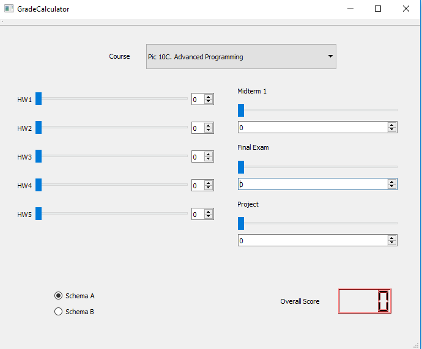

# My Other Repository
Please go check them out
Final Project: https://github.com/ukmerry/PI0C-Final-Project.git
\
Assigment 2: https://github.com/ukmerry/PIC10C-GradeCalculator.git
\
Assigment 1: https://github.com/ukmerry/PIC-10C-Assignment1.git

# PIC10C-GradeCalculator

This project aims to design and implement a Qt Graphical User Interface that computes the grade of a student given a set of homework and exam scores. In this program, we particually calculate the overall grade of PIC10C.

-Grading
5 homework
1 mid-term
1 final exam
1 final project

There are two grading breakdowns
(15% Assignments) + (25% Midterm 1) + (30% Final Exam) + (35% Final Project) = 105%
(15% Assignments) + (50% Final Exam) + (35% Final Project) = 100%

# Development Diary

v0.1 First layout of the program (without code)

v1.0 Completed SpinBox and Slider (in sync)
        Stored each hw_scores in an array
        
v1.1 Display the total score of hw

v1.2 Add the Midterm 1 and Final Exam layout to the GUI

v2.0 Complete program following the grade breakdown
(15% Assignments) + (25% Midterm 1) + (30% Final Exam) + (35% Final Project) = 105%

v2.1 Bugs Fixed - Calculation goes wrong and midterm, final exam, final project do not display normally

v2.2 Better implementaion - enhanced the efficiency of calculating the overall grade

v3.0 complete features (now can calculate both grading schema ) 

v3.1 now it can handle two coures

v3.2 better implementation for future coding and readibility

# Guide
Codes are mainly done in [this](GradeCalculator/gradecalculator.cpp) and [this](GradeCalculator/gradecalculator.h).
Please see these two files if you are seeing this in webpage.
Otherwise, you should go to the GradeCalculator file to find those two files

If you are using Windows, you can click the shortcut to run the program(download the entire repository to run the program)

# Sample

